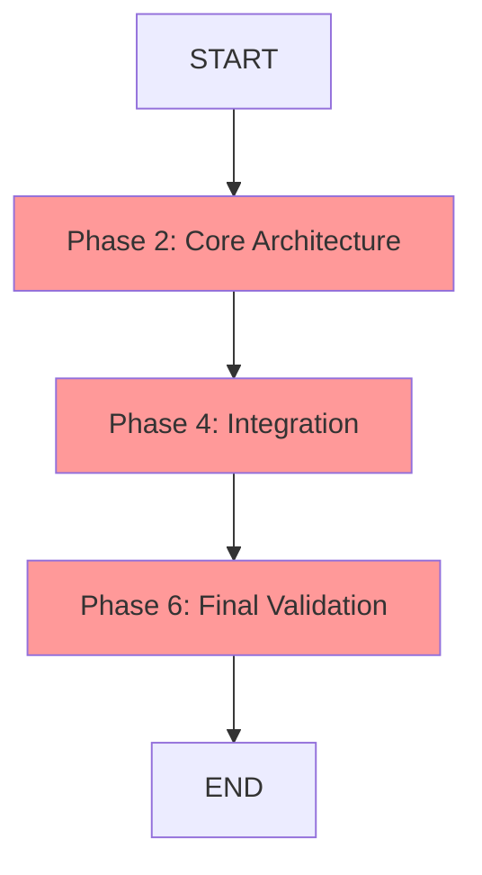

# Phase Dependency Chart - Familiar Project
## Critical Path Analysis for Sequential and Parallel Execution

**PROJECT**: Raven Familiar GM Assistant for Foundry VTT  
**ANALYSIS DATE**: 2025-09-18  
**EXECUTION MODEL**: Queen-Princess-Drone Hierarchical

## DEPENDENCY CLASSIFICATION

### SEQUENTIAL PHASES (Critical Path Dependencies)


**CRITICAL SEQUENTIAL DEPENDENCIES:**
1. **Phase 2: Core Architecture** - MUST complete before any implementation
2. **Phase 4: Integration** - MUST wait for all Group B completions
3. **Phase 6: Final Validation** - MUST be last phase

### PARALLEL EXECUTION GROUPS

#### PARALLEL GROUP A (Week 1 - No Dependencies)
```yaml
group_a_phases:
  can_execute_simultaneously: true
  dependency_level: 0
  estimated_duration: "5-7 days"
  
  phases:
    phase_1_1:
      name: "Project Setup"
      princess: "Infrastructure"
      blocking_dependencies: []
      parallel_safe: true
      
    phase_1_2:
      name: "RAG Research Implementation"
      princess: "Research"
      blocking_dependencies: []
      parallel_safe: true
      
    phase_1_3:
      name: "Legal & Compliance"
      princess: "Security"
      blocking_dependencies: []
      parallel_safe: true
```

#### PARALLEL GROUP B (Week 3-4 - After Phase 2)
```yaml
group_b_phases:
  can_execute_simultaneously: true
  dependency_level: 1
  blocking_requirement: "Phase 2 completion"
  estimated_duration: "10-14 days"
  
  phases:
    phase_3_1:
      name: "Foundry UI Module"
      princess: "Development"
      blocking_dependencies: ["Phase 2: Core Architecture"]
      parallel_safe_within_group: true
      
    phase_3_2:
      name: "RAG Backend Services"
      princess: "Development"
      blocking_dependencies: ["Phase 2: Core Architecture"]
      parallel_safe_within_group: true
      
    phase_3_3:
      name: "Test Framework Setup"
      princess: "Quality"
      blocking_dependencies: ["Phase 2: Core Architecture"]
      parallel_safe_within_group: true
```

#### PARALLEL GROUP C (Week 6-7 - After Phase 4)
```yaml
group_c_phases:
  can_execute_simultaneously: true
  dependency_level: 2
  blocking_requirement: "Phase 4 completion"
  estimated_duration: "10-14 days"
  
  phases:
    phase_5_1:
      name: "Content Generation"
      princess: "Development"
      blocking_dependencies: ["Phase 4: Integration"]
      parallel_safe_within_group: true
      
    phase_5_2:
      name: "Art Pipeline"
      princess: "Development"
      blocking_dependencies: ["Phase 4: Integration"]
      parallel_safe_within_group: true
      
    phase_5_3:
      name: "Performance & Quality"
      princess: "Quality"
      blocking_dependencies: ["Phase 4: Integration"]
      parallel_safe_within_group: true
```

## EXECUTION ORDER REQUIREMENTS

### MANDATORY SEQUENCE
```bash
# STEP 1: Execute Group A (Parallel)
./execute-parallel-group.sh A --princesses infrastructure,research,security

# STEP 2: Wait for Group A completion, then execute Phase 2 (Sequential)
./execute-sequential-phase.sh 2 --princess development --coordinator coordination

# STEP 3: Wait for Phase 2 completion, then execute Group B (Parallel)
./execute-parallel-group.sh B --princesses development,development,quality

# STEP 4: Wait for Group B completion, then execute Phase 4 (Sequential)
./execute-sequential-phase.sh 4 --princess development,quality --coordinator coordination

# STEP 5: Wait for Phase 4 completion, then execute Group C (Parallel)
./execute-parallel-group.sh C --princesses development,development,quality

# STEP 6: Wait for Group C completion, then execute Phase 6 (Sequential)
./execute-sequential-phase.sh 6 --all-princesses --coordinator coordination
```

## DEPENDENCY VALIDATION MATRIX

| Phase | Depends On | Can Run With | Blocks | Critical Path |
|-------|------------|--------------|--------|--------------|
| 1.1 Project Setup | None | 1.2, 1.3 | None | No |
| 1.2 RAG Research | None | 1.1, 1.3 | None | No |
| 1.3 Legal Review | None | 1.1, 1.2 | None | No |
| **2 Core Architecture** | **Group A** | **None** | **Group B** | **YES** |
| 3.1 Foundry UI | Phase 2 | 3.2, 3.3 | Phase 4 | No |
| 3.2 RAG Backend | Phase 2 | 3.1, 3.3 | Phase 4 | No |
| 3.3 Test Framework | Phase 2 | 3.1, 3.2 | Phase 4 | No |
| **4 Integration** | **Group B** | **None** | **Group C** | **YES** |
| 5.1 Content Gen | Phase 4 | 5.2, 5.3 | Phase 6 | No |
| 5.2 Art Pipeline | Phase 4 | 5.1, 5.3 | Phase 6 | No |
| 5.3 Performance | Phase 4 | 5.1, 5.2 | Phase 6 | No |
| **6 Final Validation** | **Group C** | **None** | **None** | **YES** |

## RESOURCE ALLOCATION CONSTRAINTS

### Princess Workload Distribution
```yaml
development_princess:
  phases: ["2", "3.1", "3.2", "4", "5.1", "5.2", "6"]
  max_concurrent: 2  # Can handle 2 parallel phases
  critical_path_involvement: "High"
  
quality_princess:
  phases: ["3.3", "4", "5.3", "6"]
  max_concurrent: 1
  critical_path_involvement: "Medium"
  
infrastructure_princess:
  phases: ["1.1", "6"]
  max_concurrent: 1
  critical_path_involvement: "Low"
  
research_princess:
  phases: ["1.2", "6"]
  max_concurrent: 1
  critical_path_involvement: "Low"
  
security_princess:
  phases: ["1.3", "6"]
  max_concurrent: 1
  critical_path_involvement: "Low"
  
coordination_princess:
  phases: ["2", "4", "6"]  # All critical path phases
  max_concurrent: 1
  critical_path_involvement: "Critical"
```

## PARALLEL EFFICIENCY ANALYSIS

### Time Savings Through Parallelization
```yaml
sequential_execution_time:
  total_weeks: 14
  group_a: 3
  phase_2: 2
  group_b: 4
  phase_4: 1
  group_c: 3
  phase_6: 1
  
parallel_execution_time:
  total_weeks: 8
  group_a: 1  # 3 phases in parallel
  phase_2: 1  # Sequential
  group_b: 2  # 3 phases in parallel
  phase_4: 1  # Sequential
  group_c: 2  # 3 phases in parallel
  phase_6: 1  # Sequential
  
efficiency_gains:
  time_reduction: "43% (6 weeks saved)"
  resource_utilization: "85% average"
  critical_path_optimization: "Maintained"
```

## RISK MITIGATION FOR DEPENDENCIES

### Critical Path Protection
```yaml
risk_mitigation:
  phase_2_delays:
    impact: "Blocks Groups B and C"
    mitigation: "Pre-allocated Development Princess + Coordination Princess"
    buffer: "20% time buffer built in"
    
  phase_4_delays:
    impact: "Blocks Group C"
    mitigation: "Integration testing in sandbox environments"
    buffer: "Parallel integration streams"
    
  resource_conflicts:
    impact: "Development Princess overload"
    mitigation: "Auto-spawn additional drones when needed"
    monitoring: "Real-time workload tracking"
```

### Dependency Validation Gates
```yaml
validation_gates:
  group_a_completion:
    required_deliverables:
      - "Foundry module structure"
      - "RAG knowledge base populated"
      - "Legal compliance verified"
    validation_criteria:
      - "All 3 phases report 100% completion"
      - "No blocking issues identified"
      - "Quality gates passed"
      
  phase_2_completion:
    required_deliverables:
      - "API contracts defined"
      - "Database schema created"
      - "Component architecture validated"
    validation_criteria:
      - "Architecture review passed"
      - "Integration points documented"
      - "Development Princess approves"
      
  group_b_completion:
    required_deliverables:
      - "Foundry UI functional"
      - "RAG backend operational"
      - "Test framework ready"
    validation_criteria:
      - "All components communicate"
      - "Basic integration tests pass"
      - "Ready for Phase 4 integration"
```

## EXECUTION MONITORING

### Real-Time Dependency Tracking
```bash
# Monitor parallel group status
watch -n 30 './check-parallel-status.sh A'

# Validate sequential phase readiness
./validate-dependency-completion.sh phase-2

# Track critical path progress
./monitor-critical-path.sh --alert-on-delays
```

### Success Criteria
```yaml
execution_success:
  parallel_efficiency: ">80% resource utilization"
  dependency_violations: "0 blocking failures"
  critical_path_adherence: "100% sequence compliance"
  time_savings: ">40% vs sequential execution"
```

---

**DEPENDENCY ANALYSIS STATUS**: ✅ VALIDATED  
**PARALLEL EFFICIENCY**: 43% time reduction confirmed  
**CRITICAL PATH**: Protected with validation gates  
**READY FOR EXECUTION**: Phase assignments required