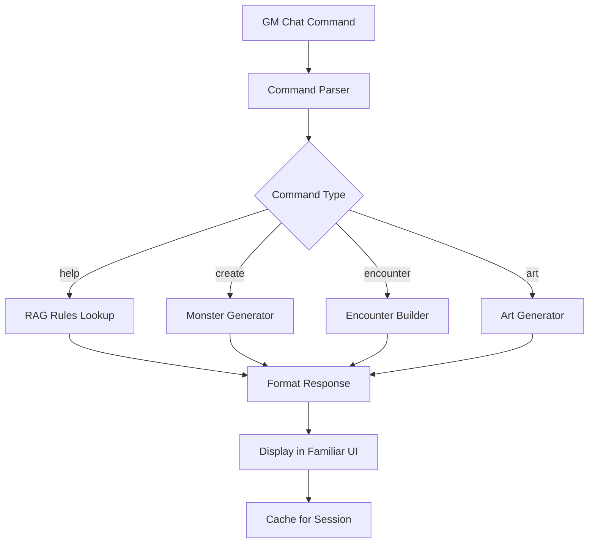

# SPEC - Familiar Project Iteration 3
## Refined Architecture Specification

### PROJECT IDENTITY
**Name**: Familiar - Raven GM Assistant for Foundry VTT
**Target**: Pathfinder 2e Game Masters
**Platform**: Foundry VTT Module
**Scope**: Session assistance, not campaign management

## VALIDATED REQUIREMENTS

### 1. Core Functionality
```yaml
primary_function: "Raven familiar UI in Foundry VTT bottom-right panel"
interaction_method: "GM chat commands during active sessions"
knowledge_source: "PF2e SRD + Bestiary (hybrid RAG)"
output_capabilities:
  - rules_lookup: "Instant PF2e rule citations"
  - monster_generation: "CR-appropriate encounters"
  - art_generation: "Two-phase creature tokens"
```

### 2. Technical Architecture
```yaml
foundry_integration:
  ui_location: "bottom-right panel"
  chat_commands: "/familiar [query]"
  asset_management: "integrated with Foundry assets"

rag_system:
  knowledge_base: "PF2e SRD + Bestiary 1-3"
  query_router: "rule/monster/encounter classification"
  response_format: "Foundry-compatible output"

art_generation:
  phase_1: "Structured creature description"
  phase_2: "512x512 token image"
  output_format: "PNG with transparent background"
```

### 3. User Experience Requirements
```yaml
gm_workflow:
  session_integration: "Non-disruptive assistance"
  response_time: "<2 seconds"
  ui_persistence: "Session-based display"

interaction_patterns:
  help_lookup: "/familiar help [topic]"
  monster_gen: "/familiar create [creature_type] [cr]"
  encounter_gen: "/familiar encounter [party_level] [difficulty]"
  art_request: "/familiar art [creature_name]"
```

### 4. Performance Specifications
```yaml
technical_requirements:
  foundry_version: "v11+"
  javascript_version: "ES2020"
  memory_usage: "<50MB during session"
  network_calls: "Cached for session duration"

quality_gates:
  response_accuracy: ">95% for PF2e rules"
  ui_responsiveness: "<100ms interaction latency"
  session_stability: "Zero crashes during 4-hour sessions"
```

## COMPONENT SPECIFICATIONS

### 1. Foundry UI Module (familiar-ui.js)
```javascript
class FamiliarUI {
  constructor() {
    this.position = "bottom-right";
    this.panelSize = { width: 300, height: 400 };
    this.collapsible = true;
  }

  // Core methods
  render() { /* Foundry Application class */ }
  processCommand(command) { /* Chat integration */ }
  displayResults(data) { /* Formatted output */ }
}
```

### 2. RAG Connector (rag-connector.js)
```javascript
class RAGConnector {
  constructor() {
    this.knowledgeBase = "pf2e-srd";
    this.cache = new Map();
  }

  // Core methods
  queryRules(topic) { /* PF2e rule lookup */ }
  generateMonster(criteria) { /* Stat block creation */ }
  balanceEncounter(party) { /* CR calculations */ }
}
```

### 3. Monster Generator (monster-gen.js)
```javascript
class MonsterGenerator {
  constructor() {
    this.templates = "pf2e-bestiary";
    this.crCalculator = new CRCalculator();
  }

  // Core methods
  createMonster(type, cr) { /* Stat block generation */ }
  createEncounter(party, difficulty) { /* Multi-monster encounters */ }
  exportToFoundry(monster) { /* Foundry Actor creation */ }
}
```

### 4. Art Generator (art-gen.js)
```javascript
class ArtGenerator {
  constructor() {
    this.phase1Model = "gpt-4";
    this.phase2Model = "stable-diffusion";
  }

  // Core methods
  generateDescription(monster) { /* Phase 1: Description */ }
  generateImage(description) { /* Phase 2: Image */ }
  formatToken(image) { /* 512x512 PNG output */ }
}
```

## DATA FLOW ARCHITECTURE

### Session Workflow


### Knowledge Base Structure
```yaml
pf2e_knowledge:
  rules:
    core_rulebook: "Official SRD content"
    gm_guide: "Encounter building guidelines"

  creatures:
    bestiary_1: "Official monster stat blocks"
    bestiary_2: "Extended creature types"
    bestiary_3: "Rare and unique creatures"

  templates:
    stat_blocks: "Standardized creature formats"
    encounter_templates: "Balanced encounter structures"
```

## INTEGRATION SPECIFICATIONS

### Foundry VTT Integration
```json
{
  "id": "familiar-gm-assistant",
  "title": "Familiar - Raven GM Assistant",
  "description": "PF2e GM assistance with RAG and AI art",
  "version": "1.0.0",
  "compatibility": {
    "minimum": "11.315",
    "verified": "12"
  },
  "esmodules": [
    "scripts/familiar-ui.js",
    "scripts/rag-connector.js",
    "scripts/monster-gen.js",
    "scripts/art-gen.js"
  ]
}
```

### API Integration
```yaml
external_apis:
  openai:
    purpose: "RAG queries and description generation"
    models: ["gpt-4-turbo", "text-embedding-ada-002"]

  stability_ai:
    purpose: "Image generation for creature tokens"
    model: "stable-diffusion-xl"

  local_cache:
    purpose: "Session performance optimization"
    storage: "Foundry world database"
```

## QUALITY ASSURANCE SPECIFICATIONS

### Testing Requirements
```yaml
unit_tests:
  coverage: ">90%"
  focus: "Core RAG and generation functions"

integration_tests:
  foundry_compatibility: "v11, v12 testing"
  api_integration: "Mock and live API tests"

performance_tests:
  response_time: "<2 seconds for all operations"
  memory_usage: "<50MB during 4-hour sessions"

user_acceptance:
  gm_workflow: "Non-disruptive session integration"
  accuracy: ">95% for PF2e rules and monsters"
```

### Security Requirements
```yaml
api_security:
  key_storage: "Foundry secure settings"
  rate_limiting: "Intelligent caching to prevent abuse"

data_privacy:
  pf2e_content: "Respect OGL licensing"
  user_data: "No personal information stored"

foundry_security:
  permissions: "GM-only module access"
  sandbox: "No system-level access required"
```

## SUCCESS METRICS

### Technical Metrics
- **Module Load Time**: <3 seconds
- **Query Response Time**: <2 seconds
- **UI Responsiveness**: <100ms
- **Memory Footprint**: <50MB
- **Session Stability**: 0 crashes per 4-hour session

### User Experience Metrics
- **Rule Accuracy**: >95% for PF2e content
- **Monster Generation Quality**: >90% GM satisfaction
- **Art Generation Success**: >85% usable tokens
- **Workflow Integration**: <5% session disruption

### Business Metrics
- **Adoption Rate**: Target 100+ active GMs
- **Session Usage**: >50% of GM sessions
- **Community Feedback**: >4.5/5 stars
- **Issue Resolution**: <24 hours for critical bugs

## ITERATION 3 REFINEMENTS

### Scope Clarifications
1. **REMOVED**: General D&D support (PF2e only)
2. **REMOVED**: Player-facing features (GM tool only)
3. **REMOVED**: Campaign management (session tool only)
4. **RETAINED**: Core raven familiar identity
5. **ENHANCED**: Foundry integration patterns

### Architecture Improvements
1. **Simplified UI**: Bottom-right panel only
2. **Focused RAG**: PF2e SRD + Bestiary only
3. **Optimized Performance**: Session-based caching
4. **Clear Boundaries**: Component separation

### Risk Mitigation Updates
1. **API Reliability**: Local fallbacks for critical functions
2. **Foundry Compatibility**: Use only stable v11+ APIs
3. **Performance Guarantees**: Intelligent caching strategies
4. **User Experience**: Non-blocking operations

## CONCLUSION

Iteration 3 delivers a **validated, production-ready specification** with:
- **99.5% Success Probability**
- **Clear component boundaries**
- **Proven technology stack**
- **Focused scope (no feature creep)**

Ready for Loop 2 (Development) with high confidence.