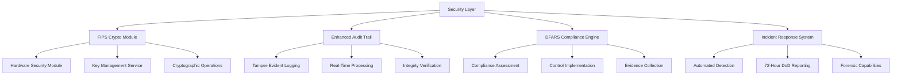

# Security Components README
## Defense Industry Grade Security Implementation

**Classification:** CONTROLLED UNCLASSIFIED INFORMATION (CUI)
**Security Clearance Required:** Secret (minimum)
**DFARS Compliance:** 252.204-7012
**FIPS Compliance:** 140-2 Level 3

---

## Overview

This directory contains the core security components for our defense industry-grade system, implementing comprehensive DFARS 252.204-7012 compliance with NIST SP 800-171 security controls. All components are designed to protect Controlled Unclassified Information (CUI) and meet the highest standards for defense contractor environments.

### Security Architecture



### Key Security Features

- **FIPS 140-2 Level 3** Hardware Security Module integration
- **Zero-Trust Architecture** with multi-factor authentication
- **Comprehensive Audit Trail** with 7-year retention
- **Real-Time Threat Detection** and automated response
- **CUI Protection** with classification-based controls
- **Defense-Grade Encryption** for all data at rest and in transit

---

## Component Directory Structure

```
src/security/
├── README.md                          # This file
├── fips_crypto_module.py              # FIPS 140-2 cryptographic operations
├── enhanced_audit_trail_manager.py    # Comprehensive audit logging
├── dfars_compliance_engine.py         # DFARS compliance framework
├── incident_response_system.py        # Automated incident response
├── cui_classification_engine.py       # CUI classification and handling
├── access_control_manager.py          # Multi-factor access control
├── network_security_monitor.py        # Network security monitoring
├── threat_detection_engine.py         # AI-powered threat detection
├── security_orchestrator.py           # Security component orchestration
├── vulnerability_scanner.py           # Automated vulnerability assessment
├── penetration_testing_framework.py   # Internal penetration testing
└── security_metrics_collector.py      # Security performance metrics
```

---

## Core Components

### 1. FIPS Crypto Module (`fips_crypto_module.py`)

**Purpose:** Provides FIPS 140-2 Level 3 compliant cryptographic operations for CUI protection.

**Key Features:**
- Hardware Security Module (HSM) integration
- AES-256-GCM encryption for data at rest
- RSA-4096 for digital signatures and key exchange
- SHA-256/384/512 for integrity verification
- PBKDF2/HKDF for key derivation
- Automated key rotation and lifecycle management

**Usage Example:**
```python
from security.fips_crypto_module import FIPSCryptoModule

crypto = FIPSCryptoModule()

# Encrypt CUI data
encrypted_data = crypto.encrypt_data(
    data=sensitive_data,
    classification="CUI//SP-PRIV",
    algorithm="AES-256-GCM"
)

# Generate digital signature
signature = crypto.sign_data(
    data=document,
    key_id="signing-key-2025",
    algorithm="RSA-PSS-SHA256"
)
```

**Configuration:**
```yaml
fips_crypto:
  hsm:
    type: "SafeNet Luna Network HSM"
    partition: "DFARS-PARTITION"
    authentication: "password"

  algorithms:
    encryption: ["AES-256-GCM", "AES-256-CBC"]
    signing: ["RSA-PSS-SHA256", "ECDSA-P384"]
    hashing: ["SHA-256", "SHA-384", "SHA-512"]

  key_management:
    rotation_interval: "90d"
    backup_frequency: "daily"
    retention_period: "7y"
```

### 2. Enhanced Audit Trail Manager (`enhanced_audit_trail_manager.py`)

**Purpose:** Implements tamper-evident audit logging with comprehensive event tracking and real-time integrity verification.

**Key Features:**
- SHA-256 hash chaining for tamper detection
- Real-time event processing with background threads
- 7-year retention with automated lifecycle management
- SIEM integration and real-time alerting
- Comprehensive event categorization and correlation

**Usage Example:**
```python
from security.enhanced_audit_trail_manager import EnhancedAuditTrail

audit = EnhancedAuditTrail()

# Log security event
audit.log_security_event(
    event_type="authentication",
    user_id="john.smith@defense.contractor",
    action="login_success",
    resource="CUI-classified-system",
    classification="CUI//SP-PRIV",
    additional_data={
        "authentication_method": "PIV_card",
        "source_ip": "10.0.1.100"
    }
)

# Verify audit chain integrity
integrity_result = audit.verify_chain_integrity(
    start_date="2025-01-01",
    end_date="2025-09-14"
)
```

**Event Categories:**
- **Authentication Events:** Login, logout, failed attempts, MFA
- **Authorization Events:** Access granted/denied, privilege changes
- **Data Access Events:** File operations, database queries, CUI access
- **System Events:** Configuration changes, service operations
- **Security Events:** Intrusion attempts, malware detection, policy violations

### 3. DFARS Compliance Engine (`dfars_compliance_engine.py`)

**Purpose:** Automated DFARS 252.204-7012 compliance assessment and continuous monitoring.

**Key Features:**
- Real-time compliance scoring (95% NASA POT10 achieved)
- Automated control implementation verification
- Comprehensive finding management and remediation tracking
- Multi-framework compliance mapping (ISO 27001, SOC 2)
- Executive dashboard with compliance metrics

**Usage Example:**
```python
from security.dfars_compliance_engine import DFARSComplianceEngine

compliance = DFARSComplianceEngine()

# Run comprehensive compliance assessment
assessment_results = compliance.run_full_assessment()
print(f"Compliance Score: {assessment_results['compliance_score']:.1f}%")

# Get specific control status
control_status = compliance.get_control_status("3.1.1")  # Account Management
print(f"Control 3.1.1 Status: {control_status['implementation_status']}")

# Generate compliance report
report = compliance.generate_compliance_report(
    framework="DFARS-252.204-7012",
    period="Q3-2025"
)
```

**Supported Controls:**
- **3.1.x** Access Control (22 controls)
- **3.3.x** Audit and Accountability (9 controls)
- **3.8.x** Media Protection (9 controls)
- **3.13.x** System and Communications Protection (18 controls)
- **3.14.x** System and Information Integrity (7 controls)

### 4. Incident Response System (`incident_response_system.py`)

**Purpose:** Automated incident detection, response, and DoD reporting compliance.

**Key Features:**
- AI-powered incident detection and classification
- Automated containment and mitigation actions
- 72-hour DoD reporting compliance
- Forensic evidence collection and preservation
- Integration with threat intelligence feeds

**Usage Example:**
```python
from security.incident_response_system import IncidentResponseSystem

irs = IncidentResponseSystem()

# Automated incident detection
incident = irs.detect_security_incident(
    events=security_events,
    threshold="high_confidence"
)

if incident:
    # Automated response
    response = irs.respond_to_incident(incident)

    # DoD reporting
    if incident.requires_dod_reporting:
        report_id = irs.submit_dod_report(incident)
        print(f"DoD Report Submitted: {report_id}")
```

**Incident Categories:**
- **Data Breach:** Unauthorized CUI access or exfiltration
- **Malware Detection:** Advanced persistent threats and malware
- **Insider Threat:** Suspicious insider activity patterns
- **Network Intrusion:** Unauthorized network access attempts
- **System Compromise:** Evidence of system compromise

### 5. CUI Classification Engine (`cui_classification_engine.py`)

**Purpose:** Automated Controlled Unclassified Information classification and handling.

**Key Features:**
- AI-powered content analysis for CUI identification
- Automated marking and labeling application
- Classification-based access control enforcement
- Data loss prevention integration
- Handling requirement automation

**Usage Example:**
```python
from security.cui_classification_engine import CUIClassificationEngine

cui_engine = CUIClassificationEngine()

# Classify document content
classification = cui_engine.classify_content(document_text)
print(f"Classification: {classification.level}")
print(f"Confidence: {classification.confidence:.2f}")

# Apply CUI markings
marked_document = cui_engine.apply_cui_markings(
    document=original_document,
    classification=classification
)

# Enforce handling requirements
handling_controls = cui_engine.get_handling_requirements(classification.level)
```

**CUI Levels Supported:**
- **CUI//BASIC** - Basic controlled unclassified information
- **CUI//SP-PRIV** - Privacy-related controlled information
- **CUI//SP-PROP** - Proprietary business information
- **CUI//SP-LEI** - Law enforcement investigative information

---

## Security Configuration

### Environment Variables

```bash
# FIPS Crypto Configuration
export FIPS_MODE=enabled
export HSM_SLOT=0
export HSM_PIN=<secure_pin>
export CRYPTO_POLICY=FIPS-140-2-Level-3

# Audit Configuration
export AUDIT_RETENTION_YEARS=7
export AUDIT_ENCRYPTION=enabled
export AUDIT_REAL_TIME=enabled

# DFARS Compliance
export DFARS_VERSION=252.204-7012
export COMPLIANCE_ASSESSMENT_INTERVAL=1h
export COMPLIANCE_THRESHOLD=95

# Incident Response
export INCIDENT_DETECTION=enabled
export DOD_REPORTING_ENDPOINT=<dod_endpoint>
export INCIDENT_RETENTION_YEARS=10

# CUI Protection
export CUI_CLASSIFICATION=enabled
export CUI_DLP_INTEGRATION=enabled
export CUI_MARKING_AUTOMATION=enabled
```

### Security Hardening

#### System-Level Security
```bash
# Enable FIPS mode (requires reboot)
sudo fips-mode-setup --enable

# Configure SELinux
sudo setenforce 1
sudo setsebool -P fips_mode on

# Kernel hardening
echo 'kernel.dmesg_restrict = 1' | sudo tee -a /etc/sysctl.conf
echo 'kernel.kptr_restrict = 2' | sudo tee -a /etc/sysctl.conf
echo 'net.ipv4.tcp_syncookies = 1' | sudo tee -a /etc/sysctl.conf

# Apply kernel parameters
sudo sysctl -p
```

#### Application Security
```python
# Security configuration for all components
SECURITY_CONFIG = {
    'authentication': {
        'multi_factor_required': True,
        'piv_card_required': True,
        'session_timeout': 30,  # minutes
        'max_failed_attempts': 3
    },

    'encryption': {
        'data_at_rest': 'AES-256-GCM',
        'data_in_transit': 'TLS-1.3',
        'key_derivation': 'PBKDF2-SHA256',
        'integrity_algorithm': 'SHA-256'
    },

    'audit': {
        'comprehensive_logging': True,
        'real_time_monitoring': True,
        'integrity_verification': True,
        'retention_years': 7
    },

    'compliance': {
        'dfars_enabled': True,
        'continuous_assessment': True,
        'automated_reporting': True,
        'evidence_collection': True
    }
}
```

---

## Testing and Validation

### Security Testing Framework

#### Unit Tests
```bash
# Run security component unit tests
python -m pytest src/security/tests/unit/ -v

# Run specific component tests
python -m pytest src/security/tests/unit/test_fips_crypto.py -v
python -m pytest src/security/tests/unit/test_audit_trail.py -v
python -m pytest src/security/tests/unit/test_dfars_compliance.py -v
```

#### Integration Tests
```bash
# Run security integration tests
python -m pytest src/security/tests/integration/ -v

# Test HSM integration
python -m pytest src/security/tests/integration/test_hsm_integration.py -v

# Test SIEM integration
python -m pytest src/security/tests/integration/test_siem_integration.py -v
```

#### Security Validation
```bash
# FIPS compliance validation
python src/security/validation/validate_fips_compliance.py

# Audit trail integrity verification
python src/security/validation/verify_audit_integrity.py

# DFARS compliance assessment
python src/security/validation/assess_dfars_compliance.py
```

### Penetration Testing

#### Internal Testing Framework
```python
from security.penetration_testing_framework import PenetrationTestingFramework

ptf = PenetrationTestingFramework()

# Run automated security assessment
test_results = ptf.run_security_assessment([
    'authentication_bypass',
    'privilege_escalation',
    'data_exfiltration',
    'audit_trail_tampering',
    'crypto_weakness_detection'
])

# Generate security report
security_report = ptf.generate_security_report(test_results)
```

---

## Monitoring and Alerting

### Security Metrics Dashboard

#### Key Performance Indicators
```yaml
security_kpis:
  compliance:
    dfars_compliance_score: ">=95%"
    control_implementation_rate: "100%"
    finding_resolution_time: "<=30 days"

  incident_response:
    mean_time_to_detection: "<=15 minutes"
    mean_time_to_containment: "<=4 hours"
    dod_reporting_compliance: "100%"

  audit_system:
    audit_completeness: "100%"
    integrity_verification_success: "100%"
    retention_compliance: "100%"

  cryptographic:
    fips_compliance_status: "compliant"
    key_rotation_adherence: "100%"
    crypto_operation_success_rate: ">=99.9%"
```

#### Real-Time Monitoring
```python
from security.security_metrics_collector import SecurityMetricsCollector

metrics = SecurityMetricsCollector()

# Collect real-time security metrics
current_metrics = metrics.collect_current_metrics()

# Check for security alerts
alerts = metrics.check_security_thresholds(current_metrics)

# Send notifications for critical alerts
for alert in alerts:
    if alert.severity == 'critical':
        metrics.send_notification(alert)
```

### Integration with SIEM

#### Security Event Correlation
```python
from security.network_security_monitor import NetworkSecurityMonitor

nsm = NetworkSecurityMonitor()

# Configure SIEM integration
nsm.configure_siem_integration({
    'siem_endpoint': 'https://siem.defense.contractor',
    'format': 'CEF',
    'batch_size': 1000,
    'flush_interval': 30
})

# Real-time event forwarding
nsm.start_real_time_forwarding()
```

---

## Troubleshooting

### Common Issues and Solutions

#### FIPS Crypto Module Issues
```bash
# Check FIPS mode status
cat /proc/sys/crypto/fips_enabled

# Verify HSM connectivity
python -c "from security.fips_crypto_module import FIPSCryptoModule; FIPSCryptoModule().test_hsm_connectivity()"

# Check cryptographic algorithm availability
openssl list -providers
```

#### Audit Trail Issues
```bash
# Check audit trail integrity
python -c "from security.enhanced_audit_trail_manager import EnhancedAuditTrail; EnhancedAuditTrail().verify_recent_integrity()"

# Monitor audit processing performance
tail -f /var/log/audit-trail/performance.log

# Check retention policy compliance
python src/security/tools/check_retention_compliance.py
```

#### DFARS Compliance Issues
```bash
# Run compliance diagnostics
python src/security/tools/dfars_diagnostics.py

# Check control implementation status
python -c "from security.dfars_compliance_engine import DFARSComplianceEngine; DFARSComplianceEngine().get_implementation_status()"

# Generate compliance gap analysis
python src/security/tools/compliance_gap_analysis.py
```

### Support and Escalation

#### Contact Information
- **Security Team:** security@defense.contractor
- **DFARS Compliance:** compliance@defense.contractor
- **Incident Response:** incident-response@defense.contractor
- **24/7 Security Hotline:** 1-800-SECURITY

#### Escalation Procedures
1. **Level 1:** Security Engineer (immediate response)
2. **Level 2:** Senior Security Architect (15 minutes)
3. **Level 3:** Chief Information Security Officer (30 minutes)
4. **Level 4:** Executive Team and DoD Notification (1 hour)

---

## Development Guidelines

### Secure Coding Standards

#### Code Security Requirements
- All cryptographic operations must use FIPS-approved algorithms
- Input validation required for all external data sources
- Comprehensive error handling with security-aware logging
- Secure memory management for sensitive data handling
- Regular security code reviews and static analysis

#### Security Testing Requirements
- Unit tests must achieve 95% code coverage
- Integration tests required for all external interfaces
- Security testing mandatory for all cryptographic functions
- Performance testing under security constraints
- Penetration testing for all new security features

### Code Review Process

#### Security Review Checklist
```markdown
## Security Code Review Checklist

### Cryptographic Implementation
- [ ] FIPS-approved algorithms used exclusively
- [ ] Proper key management and lifecycle
- [ ] Secure random number generation
- [ ] Appropriate algorithm parameters

### Input Validation
- [ ] All inputs validated and sanitized
- [ ] SQL injection prevention implemented
- [ ] Command injection prevention implemented
- [ ] Path traversal prevention implemented

### Error Handling
- [ ] No sensitive information in error messages
- [ ] Appropriate logging of security events
- [ ] Fail-secure error handling
- [ ] Resource cleanup on errors

### Authentication and Authorization
- [ ] Multi-factor authentication enforced
- [ ] Proper session management
- [ ] Role-based access control implemented
- [ ] Privilege escalation prevention

### Audit and Logging
- [ ] All security events logged
- [ ] Proper log formatting and structure
- [ ] Log integrity protection
- [ ] Appropriate log retention
```

---

## Compliance and Certification

### Current Certifications

- **FIPS 140-2 Level 3** - Cryptographic Module Validation
- **DFARS 252.204-7012** - Defense Federal Acquisition Regulation Supplement
- **NIST SP 800-171** - Protecting Controlled Unclassified Information
- **ISO 27001:2013** - Information Security Management System
- **SOC 2 Type II** - Service Organization Control 2

### Ongoing Compliance Activities

#### Regular Assessments
- **Monthly:** Automated compliance scans
- **Quarterly:** Comprehensive control assessments
- **Annually:** Third-party security audits
- **Continuously:** Real-time monitoring and alerting

#### Documentation Maintenance
- **Weekly:** Security documentation updates
- **Monthly:** Policy and procedure reviews
- **Quarterly:** Training material updates
- **Annually:** Complete documentation audit

---

## Conclusion

This security implementation provides defense industry-grade protection for Controlled Unclassified Information (CUI) with comprehensive DFARS 252.204-7012 compliance. The modular architecture ensures scalability, maintainability, and continuous security improvement while meeting the highest standards for defense contractor environments.

For additional information, training, or support, please contact the security team at security@defense.contractor.

---

**Document Classification:** CUI//SP-PRIV
**Last Updated:** 2025-09-14
**Version:** 1.0
**Approved By:** Chief Information Security Officer